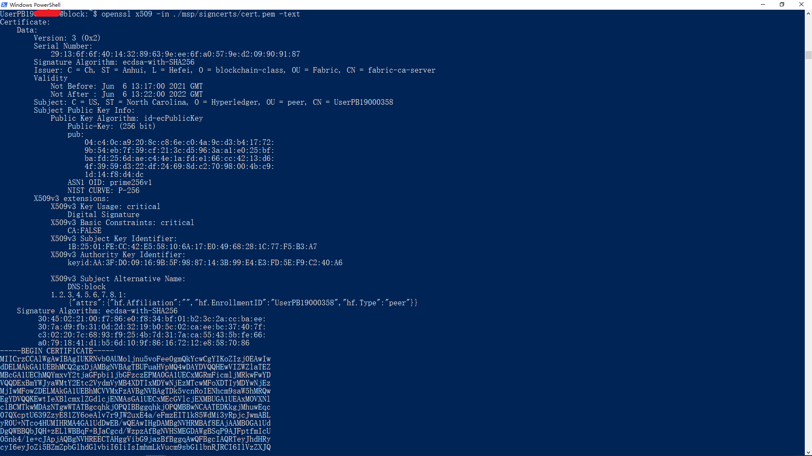
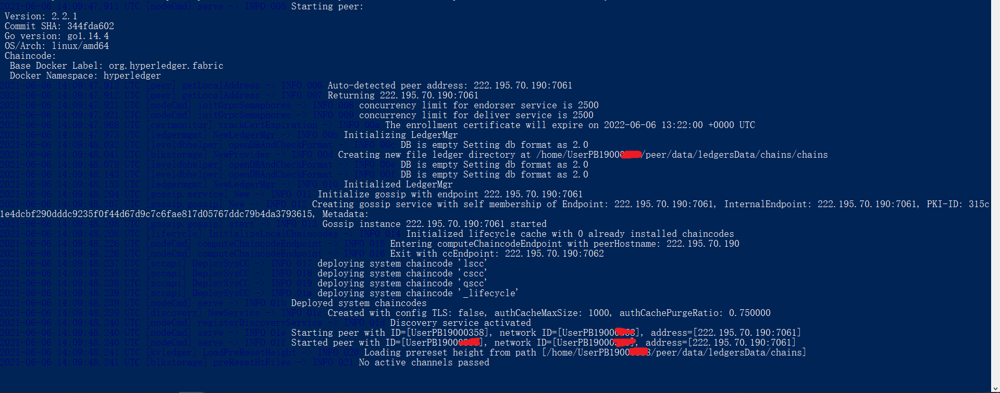
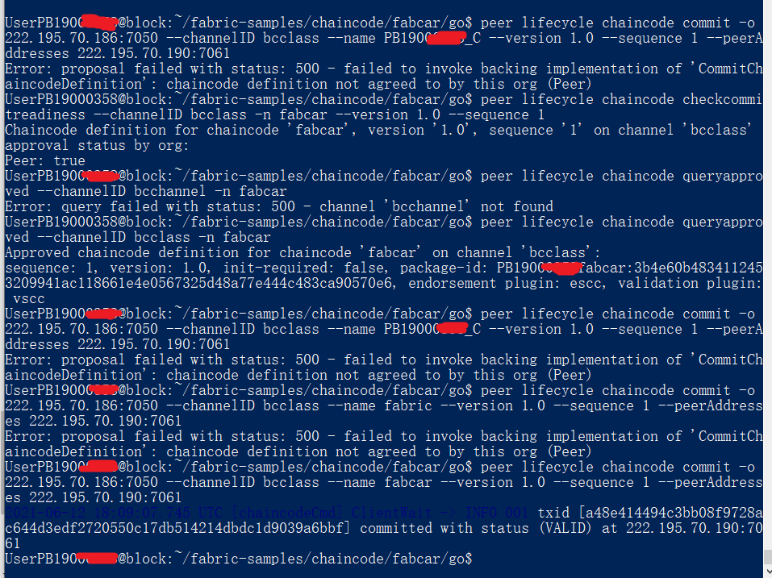
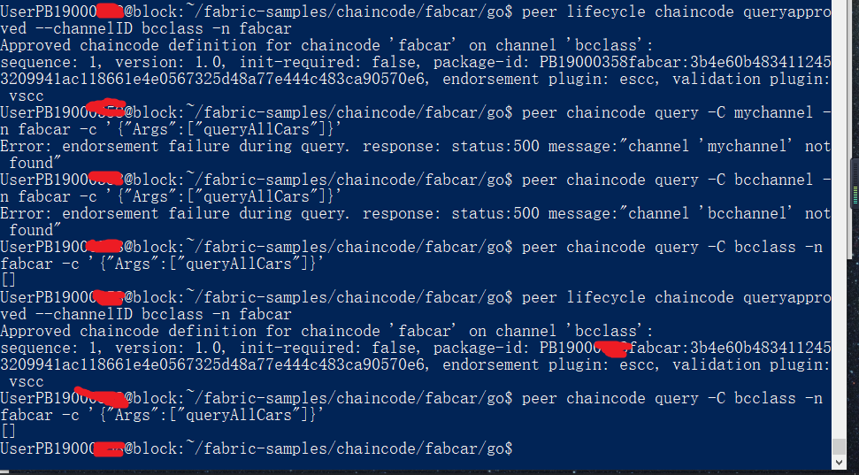

# 搭建一个真实的区块链系统
作者：Karen "the Fantasist"
全文遵守CC BY-NC-SA 4.0协议
本文首发于Github，授权发布于USTC LUG Planet 公开平台

***

<h3>目录</h3>

- [搭建一个真实的区块链系统](#搭建一个真实的区块链系统)
    - [区块链与 Hyperledger Fabric 联盟链简介](#区块链与-hyperledger-fabric-联盟链简介)
      - [区块链简介](#区块链简介)
        - [特点](#特点)
        - [分类](#分类)
      - [关于联盟链](#关于联盟链)
        - [特点](#特点-1)
        - [关于 Hyperledger 与 Fabric](#关于-hyperledger-与-fabric)
    - [开发环境](#开发环境)
    - [操作步骤](#操作步骤)
        - [Fabric-CA服务搭建](#fabric-ca服务搭建)
          - [预备阶段: 建立 fabric-ca 的工作目录，并指定家目录](#预备阶段-建立-fabric-ca-的工作目录并指定家目录)
          - [初始化（init）](#初始化init)
          - [修改配置文件](#修改配置文件)
          - [启动 CA 服务](#启动-ca-服务)
        - [Peer节点的注册](#peer节点的注册)
          - [注册身份](#注册身份)
          - [查看pem证书](#查看pem证书)
        - [启用Peer节点](#启用peer节点)
          - [构造msp文件夹](#构造msp文件夹)
          - [配置core.yaml文件](#配置coreyaml文件)
          - [环境变量的设置要点](#环境变量的设置要点)
          - [启动Peer](#启动peer)
        - [将Peer节点加入通道](#将peer节点加入通道)
          - [获取配置区块](#获取配置区块)
          - [peer加入通道](#peer加入通道)
      - [链码的前期配置](#链码的前期配置)
        - [链码打包](#链码打包)
        - [链码安装](#链码安装)
        - [链码准入](#链码准入)
      - [链码上链](#链码上链)
  - [参考文献](#参考文献)

***
### 区块链与 Hyperledger Fabric 联盟链简介

#### 区块链简介
区块链技术是在不完全可信的环境中，通过构建点对点网络，利用链式数据结构来验证与存储数据，借助分布式共识机制来确定区块链结构，利用密码学的方式保证数据传输和访问的安全，利用由自动化脚本代码组成的智能合约来编程和操作数据。
##### 特点
* 由众多节点共同组成一个端到端的网络， 不存在中心化的设备和管理机构。 节点之间数据交换通过数字签名技术进行验证， 无需互相信任， 只要按照系统既定的规则进行， 节点之间不能也无法欺骗其它节点。
* 任何人都可以参与到区块链网络， 每一台设备都能作为一个节点， 每个节点都允许获得一份完整的数据库拷贝。 节点间基于一套共识机制， 通过竞争计算共同维护整个区块链。 任一节点失效， 其余节点仍能正常工作
* 区块链的运行规则是公开透明的， 所有的数据信息也是公开的， 因此每一笔交易都对所有节点可见。 由于节点与节点之间是去信任的， 因此节点之间无需公开身份， 每个参与的节点都是匿名的。
* 单个甚至多个节点对数据库的修改无法影响其他节点的数据库， 除非能控制整个网络中超过51%的节点同时修改， 这几乎不可能发生。 区块链中的每一笔交易都通过密码学方法与相邻两个区块串联， 因此可以追溯到任何一笔交易的前世今生。
##### 分类
* 公有链
  + 无官方组织及管理机构，无中心服务器，参与的节点按照系统规则自由接入网络、不受控制，节点间基于共识机制开展工作。
* 联盟链
  + 由若干机构联合发起，介于公有链和私有链之间，兼具部分去中心化的特性。
* 私有链
  + 建立在某个组织内部，系统的运作规则根据组织要求设定，修改甚至是读取权限仅限于少数节点，同时仍保留着区块链的真实性和部分去中心化特征

<br>

#### 关于联盟链

* 联盟链是由多个机构共同参与管理的区块链，每个组织或机构管理一个或多个节点，其数据只允许系统内不同的机构进行读写和发送。联盟链的各个节点通常有与之对应的实体机构组织，通过授权后才能加入与退出网络。各机构组织组成利益相关的联盟，共同维护区块链的健康运转。
* 联盟链内部会指定多个预选的节点为记账人，每个块的生成由所有的预选节点共同决定，其他接入节点可以参与交易，但不过问记账过程，其他第三方可以通过该区块链开放的API进行限定查询。

##### 特点

* 联盟链部分去中心化。与传统的公有链不同，联盟链在某种程度上只属于联盟内部的成员所有，由于其节点不多，达成共识较为容易，交易速度相对会快很多。
* 联盟链可控性更强。公有链的节点一般是海量的（如比特币、以太坊），要篡改区块数据，几乎是不可能完成的任务，而对联盟链而言，只要大部分联盟链内加盟机构达成共识，即可更改区块数据。
* 联盟链的数据只限于联盟里的机构及其用户才有权限进行访问，数据不默认公开，这可以提供更好的隐私保护。其节点实名、基本可信。
* 联盟链以其上运行的商业业务价值为激励，而非公有链常用的、能耗相当高的POW解决方案。

##### 关于 Hyperledger 与 Fabric
2015年12月，由开源世界的旗舰组织——Linux基金会牵头，联合30家初始企业成员（包括IBM、Accenture、Intel、J.P. Morgan、R3、DAH、DTCC、FUJITSU、HITACHI、SWIFT、Cisco等），共同宣布了Hyperledger（超级账本）联合项目的成立。超级账本项目致力为透明、公开、去中心化的企业级分布式账本技术提供开源参考实现，并推动区块链和分布式账本相关协议、规范和标准的发展。项目官方网站为hyperledger.org。

* 超级账本是一个联合项目（Collaborative Project），由面向不同目的和场景的子项目构成。目前包括Fabric、SawToothLake、Iroha、Blockchain Explorer、Cello、Indy、Composer、Burrow、Quilt、Caliper等十多个顶级项目，所有项目都遵守Apache v2许可，并约定共同遵守如下的基本原则：
  + 重视模块化设计：包括交易、合同、一致性、身份、存储等技术场景；
  + 重视代码可读性：保障新功能和模块都可以很容易添加和扩展；
  + 可持续的演化路线：随着需求的深入和更多的应用场景，不断增加和演化新的项目。
<br>

* Hyperledger 所有项目代码托管在 Gerrit 和 Github上。Fabric 是 Hyperledger 的顶级项目之一，是 Hyperledger 生态系统的重要组成成分。 Fabric 支持用Java、Go和Node.js等通用编程语言编写的智能合约。这意味着大多数企业已经具备了开发智能合约所需的技能，而不需要额外的培训来学习新的开发语言。
<br>

* Hyperledger Fabric 是一个平台，网络的成员需要从可信赖的成员服务提供者（MSP）注册。其在一组已知、已识别且经常经过审查的参与者之间运作，这些参与者之间有基础的互信。
  + 由于联盟链成员已经有了基础的互信，故而在交易时可以使用更传统的崩溃容错（CFT）或拜占庭容错（BFT）共识协议，无需使用代价高昂的工作量证明（POW）机制。
  + 在大多数情况下，多个组织会聚集到一起作为一个联盟来形成一个网络，并且，它们的权限是由一套在网络最初配置的时候联盟成员都同意的规则来决定的。网络的规则可以在联盟中的组织同意的情况下随时地被改变。


***

### 开发环境

本机：Windows 10 21H2 PowerShell


这里可以随意使用各大云服务商提供的VPS。

或者，若本机性能较强，甚至甚至使用本地虚拟化环境（VMware / Hyper-V / VirtualBox）以构建自己的虚拟网络。

我这里的示例将使用USTCt=提供的云服务器直接完成Fabric联盟链的构建。

这里我们的主机(CA)ip地址：222.195.70.186
OS: Ubuntu 18.04.4 LTS


成员机构ip地址：222.195.70.190
OS: Ubuntu 18.04.4 LTS


***

### 操作步骤

##### Fabric-CA服务搭建

  + 以下操作在222.195.70.186 完成

Fabric 提供了一个搭建 CA 服务器的工具 fabric-ca-server，其提供了三条命令
init: 初始化 fabric-ca 服务
start: 启动 fabric-ca 服务
version：显示 Fabric

Fabric CA 服务搭建分三步： 初始化（init）-> 修改配置文件 -> 启动服务（start）->
生成 admin 的证书。对 Fabric CA server 具体的配置的设定可以通过三个方式
1.命令参数
2.环境变量
3.配置文件

fabric-ca-server 的家目录（即工作目录也有如下判定规则）
1.以命令行中-home 提供的参数为家目录，若未指定则使用 2
2.以 FABRIC_CA_SERVER_HOME 为家目录，若未指定则使用 3
3.以 FABRIC_CA_HOME 为家目录，若未指定则使用 4
4.以 CA_CFG_PATH 为家目录，若未指定则使用 5
5.当前工作路径

###### 预备阶段: 建立 fabric-ca 的工作目录，并指定家目录
```
    ca-server:~$ mkdir ca-server
    ca-server:~$ cp ./bin/fabric-ca-server ca-server
```

###### 初始化（init）
```
ca-server:~/ca-server$ ./fabric-ca-server init -b admin:adminpw
```
当禁用 LDAP 时，需要-b（bootsrtap identity）提供 fabric-ca-server 的引导用户。这
个引导用户同时也是 fabric-ca-server 的 administrator。

###### 修改配置文件
参照
https://hyperledger-fabric-ca.readthedocs.io/en/latest/deployguide/cadeploy.html


###### 启动 CA 服务
由于 CA 自签名的证书内容与.yaml 配置文件相关，所以当修改了.yaml 文件之后，需要删除已产生的MSP文件夹和 ca-cert.pem证书，然后再启动服务 。启动服务时，fabric-ca-server 会自动检测当前家目录下是否存在私钥和证书。如果不存在会先根据.yaml 文件生成私钥和证书然后再启动服务

···

至此，我们的CA服务器成功搭建完成。

注意：我们这里设置的CA开放的端口为7056，设置的初始组织Peer，初始通道为bcclass

***
##### Peer节点的注册
我们之前已经搭建好了CA，已有CA的admin证书，组织的admin证书。这里我们使用CA的admin证书去注册自己在fabric组织中的peer证书。主要使用的是CA客户端的服务。

###### 注册身份
我们首先执行复制指令，将课程主服务器上的CA服务器管理员身份文件传输到子服务器中
```
scp -r User1:folder folder2
```
然后使用CA服务器管理员身份文件注册身份，获得证书
```
注册组织peer (一定要记得 --home指定目录或者export设置环境变量)
fabric-ca-client register --id.name myname_1 --id.secret mysecret --id.type peer -u http://127.0.0.1:7056 --mspdir ./admin/msp

```

###### 查看pem证书
使用命令：
```
openssl x509 -in ./msp/signcerts/cert.pem -text
```

如下图所示：


##### 启用Peer节点

我们接下来的主要工作为

1. 构造msp文件夹
2. 配置好core.yaml文件
3. 设置环境变量（如果有需要）
4. 启动peer

###### 构造msp文件夹
关于msp文件夹的构建，我们刚才直接从CA处拷贝了一份，无需进行太多修改。

检查msp文件夹中是否包括如下内容：
+ cacerts\ 
  + root ca 的自签名证书
+ intermediatecerts\ 
  + 中间 ca 的自签名证书
+ keystore\ 
  + 私钥
+ signcerts\
  +  证书
+ tlscacerts\
  + tls root ca 的证书
+ lsintermediatecerts\
  + tls 中间 ca 的证书
+ config.yaml 
  + 配置文件

###### 配置core.yaml文件
core.yaml的配置要点是需要修改Peer下的ip地址与端口号。
* Peer 在逻辑上属于某一组织， 在功能上需要与同组织的节点通过 gossip 协议进行交互， 并且保存链数据等。
那么最基本的配置应该包括：
  + 本节点的身份信息：
    + id： 本节点的 id
    + mspConfigPath： 节点的 msp
  + 节点所在组织标识
    + localMspId: 节点所在组织的 Id， 应与通道中该组织的 ID 一致。
  + 组织中的节点或组织外的节点通信的部分：
    + listenAddress：
    + address： 这个地址是暴露给组织内部的节点， 与 gossip 中的 endpoint 功能重复 ， 设置成相同值
  + gossip
    + bootstrap： 组织中其他节点的地址
    + endpoint： 暴露给组织中其他节点的地址
    + externalEndpoint： 暴露给组织外的节点地址
  + 区块联的数据存放路径：
    + fileSystemPath


###### 环境变量的设置要点

我们需要修改的环境变量有：
+ FABRIC_CFG_PATH 指向core.yaml所在文件夹
+ CORE_PEER_MSPCONFIGPATH 指向admin用户所在文件夹
+ CORE_PEER_ADDRESS 启动的peer服务的ip地址:端口
+ CORE_PEER_LOCALMSPID 设置连接peer的localmspid
+ CORE_PEER_MSPCONFIGPATH 设置msp文件的目录路径

<br>

###### 启动Peer
执行命令
```
peer node start
```
以启动Peer节点

<br>

启动后结果如图所示


***

##### 将Peer节点加入通道


如果证书有效，节点配置正确，则此时peer已经具备加入通道的能力。

peer通道操作命令文档见 [peer channel — hyperledger-fabricdocs master 文档](https://hyperledger-fabric.readthedocs.io/zh_CN/release-2.2/commands/peerchannel.html)

调用如下命令加入通道（以下为示例参数，具体参数自行修改）


###### 获取配置区块
```
peer channel fetch config mychannel.genesis.block -c mychannel --orderer orderer.example.com:7050
```
###### peer加入通道
* （加入通道的创世区块可以使用peer channel fetch获得）
```
peer channel join -b mychannel.genesis.block
```


执行以下命令，查看peer加入的通道名称：

```
peer channel list
```

实操输出信息如下图所示


***

  <h3> 至此，我们完成了前置的区块链基础设施的构建。接下来我们将基于这一基础设施，完成联盟链的应用配置</h3>

***
  
* 以下的所有文本的代码均仅为示例代码，具体的参数请自行修改！！！
   + 可以参考示例截图中的参数设置理解参数的具体含义

#### 链码的前期配置
  
##### 链码打包

进入CLI容器`docker exec -it cli-org1 /bin/bash`，打包交易

    peer lifecycle chaincode package fabcar.tar.gz \
     --path go/ --lang golang --label fabcar_1

如果在打包的过程中，有go的包下载问题，可以通过换源来改善。对应在docker-compose.yml中添加环境变量

```
      - GOPROXY=https://goproxy.cn,direct
      - GO111MODULE=on
```

***

##### 链码安装

```
//这里需要使用admin的证书来进行链码安装操作
export CORE_PEER_MSPCONFIGPATH=/etc/hyperledger/org1/admin/msp
//安装链码
peer lifecycle chaincode install fabcar.tar.gz
//查询安装的链码
peer lifecycle chaincode queryinstalled
```

***

##### 链码准入

```
export CORE_PEER_MSPCONFIGPATH=/etc/hyperledger/org1/admin/msp
peer lifecycle chaincode queryinstalled

export VERSION=1
export PACKAGE_ID=fabcar_1:{查询到的编码}
// tls证书
export ORDERER_CA=/etc/hyperledger/org1/peer1/tls-msp/tlscacerts/tls-172-16-4-35-7052.pem.pem
export CHANNEL_NAME=mychannel

peer lifecycle chaincode approveformyorg -o orderer1-org0:7050 --ordererTLSHostnameOverride orderer1-org0 --tls --cafile ${ORDERER_CA} --channelID ${CHANNEL_NAME} --name fabcar --version ${VERSION} --package-id ${PACKAGE_ID} --sequence ${VERSION}
```

可以看到如下准入消息
```
2022-05-20 02:51:35.351 UTC [chaincodeCmd] ClientWait -> INFO 047 txid [fbe34d7865fd4b47c73bb9d7631fcb8045066608075ae643876011b43bbaf5e6] committed with status (VALID) at 
```

也可以通过指令`checkcommitreadiness`来进行查看

```
 peer lifecycle chaincode checkcommitreadiness  --channelID mychannel --name fabcar --version 1  --sequence 1 --output json
```

可以看到通过链码的节点情况：

```
{
        "approvals": {
                "org1MSP": true
        }
}
```
* 链码打包、准入与安装信息如下图所示：



***

#### 链码上链


在满足链码的准入机制后，我们就可以对于链码进行上链操作。

执行命令
```
peer lifecycle chaincode commit -o orderer1-org0:7050 --ordererTLSHostnameOverride orderer1-org0 --tls --cafile $ORDERER_CA --channelID $CHANNEL_NAME --name fabcar --peerAddresses peer1-org1:7051 --tlsRootCertFiles ${ORDERER_CA}  --version ${VERSION} --sequence ${VERSION} 
```

如果成功，我们可以看到如下示例：

```
2022-05-20 03:03:43.671 UTC [chaincodeCmd] ClientWait -> INFO 047 txid [c8e5dc78798684516775efbd0945b5d6feface68bad023b86ae8e919aedbb387] committed with status (VALID) at peer1-org1:7051
```

我们也可以通过指令`peer lifecycle chaincode querycommitted `来验证链码是否提交成功。

```
peer lifecycle chaincode querycommitted --channelID mychannel --name fabcar
```

之后我们就可以通过`peer chaincode invoke `指令来进行链码的调用了。

```
初始化账本
peer chaincode invoke -o orderer1-org0:7050 --ordererTLSHostnameOverride orderer1-org0 --tls --cafile $ORDERER_CA -C $CHANNEL_NAME -n fabcar --peerAddresses peer2-org1:7051 --tlsRootCertFiles ${ORDERER_CA}  -c '{"function":"initLedger","Args":[]}'

查询资产
peer chaincode query -C mychannel -n car -c '{"Args":["queryAllCars"]}'
```

我们的实操示例如下图所示：



***

  + 至此，我们成功完成了区块链联盟链的搭建
  + 如对文本内存在疑问，请电邮联系2802958826@qq.com

## 参考文献

peer channel — hyperledger-fabricdocs master 文档
https://hyperledger-fabric.readthedocs.io/zh_CN/release-2.2/commands/peerchannel.html

fabric智能合约的api 入门 — hyperledger-fabricdocs master 文档
https://hyperledger-fabric.readthedocs.io/zh_CN/release-2.2/getting_started.html#hyperledger-fabric-api

部署链码的官方教程 Deploying a smart contract to a channel — hyperledger-fabricdocs master 文档
https://hyperledger-fabric.readthedocs.io/zh_CN/release-2.2/deploy_chaincode.html

编写智能合约举例编写你的第一个应用 — hyperledger-fabricdocs master 文档
https://hyperledger-fabric.readthedocs.io/zh_CN/release-2.2/write_first_app.html

官方链码实例 hyperledger/fabric-samples (github.com)
https://github.com/hyperledger/fabric-samples

同时感谢中国科学技术大学计算机学院李京老师与人文学院科技传播系吴绮来老师。